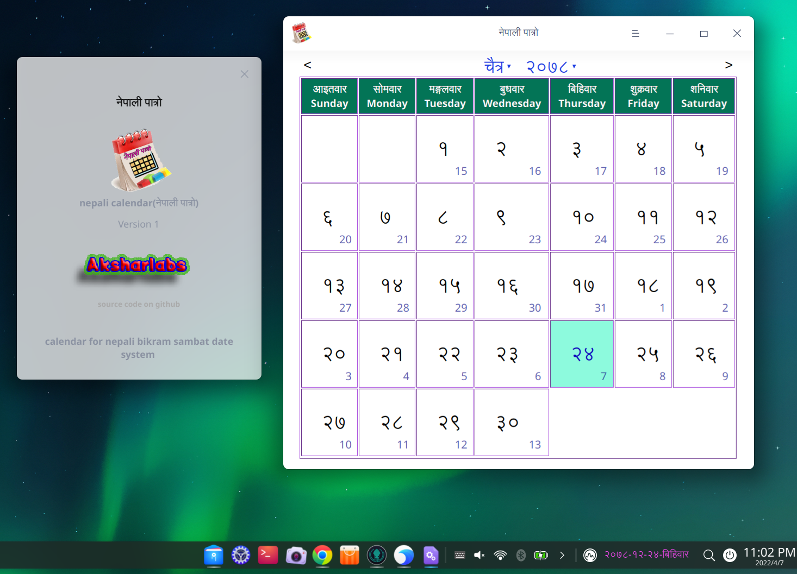

## nepali calendar application  made with deepin toolkit and qt5

# build dependencies

install these libraries along with qt build packages to build and run 

 qt5-default libdtkcommon-dev libdtkcommon libdtkcore-dev  libdtkcore5.5 libdtkgui-dev libdtkgui5.5 libdtkwidget-dev libdtkwidget5.5 qtwebengine5-dev libqt5webenginecore5 libqt5webenginewidgets5

# install above non dev packages as runtime libraries if you want to run application

# sorry i ihave not time to build for non deepin distros i have aded non-dtk-based folder. this can be built with qmake or qtcreator.

